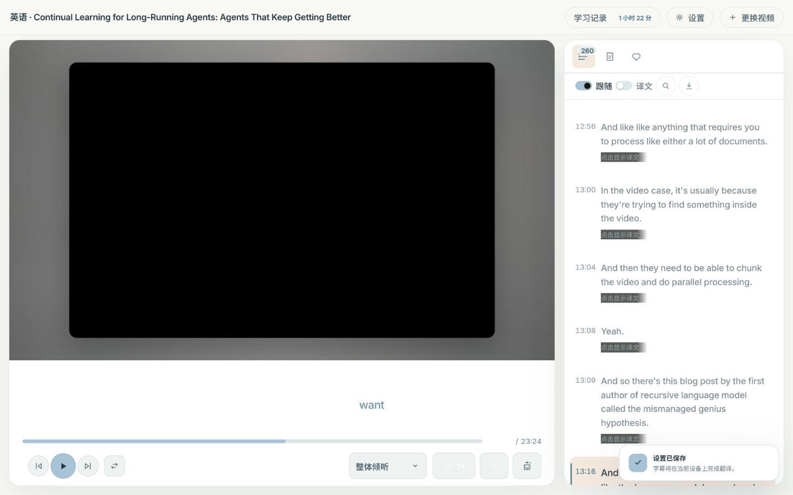
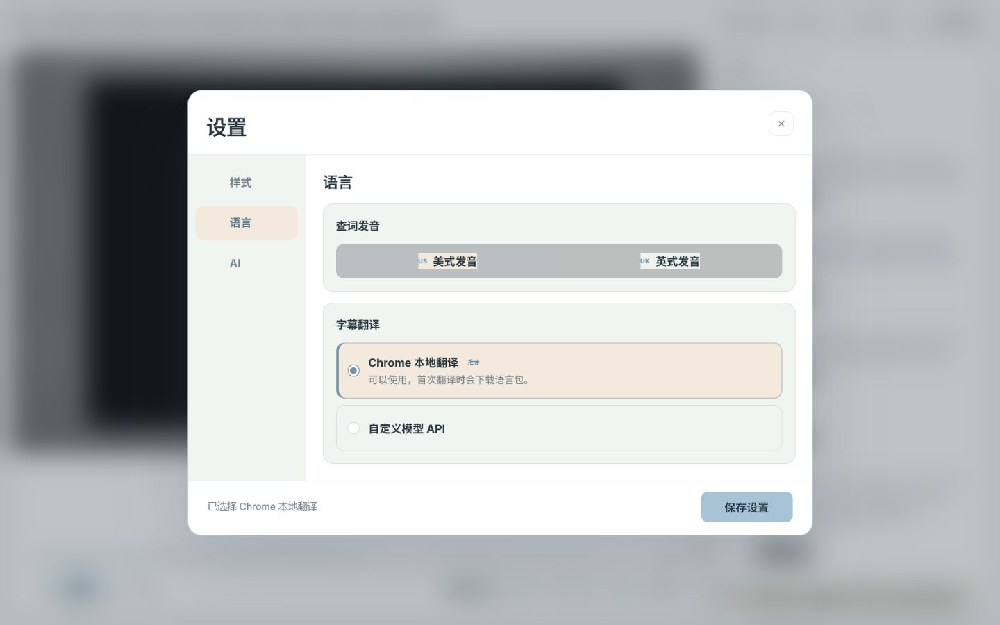
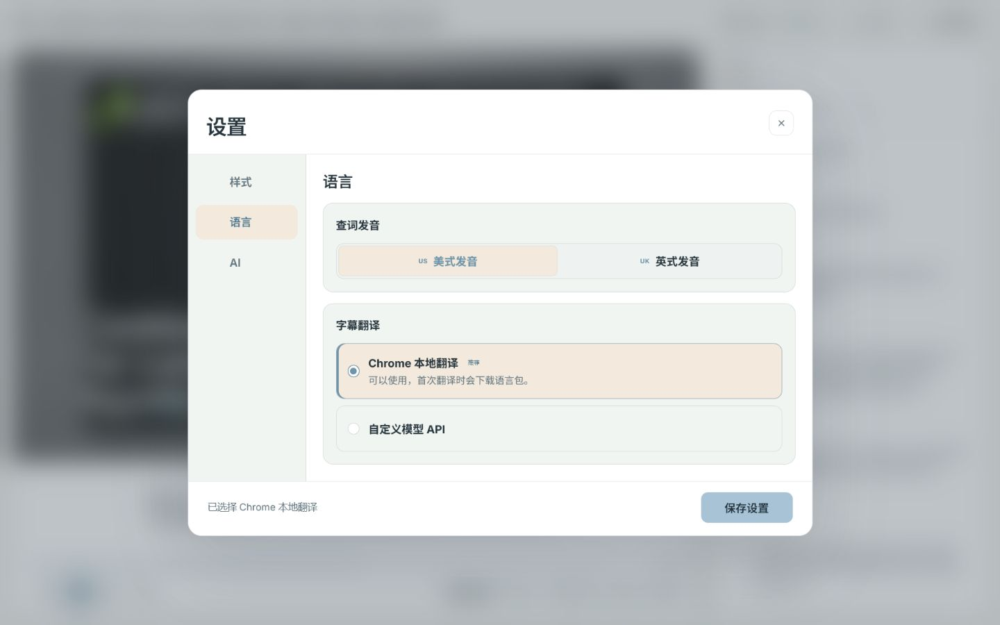
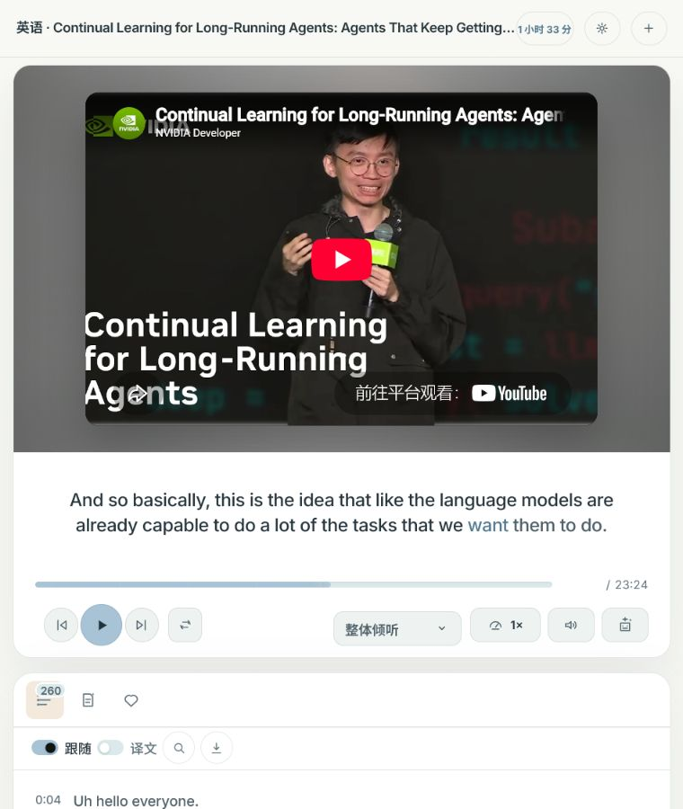

# VReply 主题显示审查

审查范围：练习页、逐句字幕、内容简介、单词页、影子跟读、播放调节弹层，以及设置中的样式、语言、AI 页面。覆盖 1440×900、760×900、390×844 三种视口。

## 1. 白天练习页 — 已修复

- 原字幕单词继承了仅适合深色背景的白色，未读词、已读词及翻译在浅色字幕区中对比不足。
- 逐句字幕整体透明度叠加在浅色文字上，隐藏译文提示还沿用深色遮罩，形成黑色重叠块。
- 修复后使用白天主题的正文、次级文字和强调色；浅色逐句字幕保持完整不透明度；隐藏译文遮罩跟随所在表面颜色。

基线：

结果：

## 2. 设置与播放调节 — 已修复

- 美式/英式发音原先把背景和边框加在文字内层，导致局部色块与外层选项重叠；现改为整项选中态，文字内层保持透明。
- 倍速、音量的图标与数值原先仍使用白色；调节弹层标题、数值和滑杆也沿用深色配色。现全部通过主题色统一。
- 播放模式、倍速、音量、句子分析四项高度由 48px 收紧为 38px，与“循环当前句”一致。
- 主题名称更新为“静夜”“晴昼”，保留“跟随系统”。

基线：

结果：

调节弹层：

## 3. 状态、标记与动效 — 已修复

- 两套主题的当前句左侧标记恢复为黄色上下渐隐竖条。
- 播放进度填充层恢复 `progress-fill-sweep` 与 `progress-fill-ripple`，周期为 4.8 秒；系统启用“减少动态效果”时仍停止动画。
- 内容简介错误态改用可读的主题警示色。
- 单词页移除白天模式中的黑色粘性页头，并修复空状态、释义、来源与操作文字的主题色。
- 影子跟读结果中的正确、注意、错误和多余词状态补齐白天主题颜色。

夜间结果：

内容简介：

单词页：

## 4. 响应式与证据 — 通过

- 760px 时将设置与更换视频收为图标按钮，学习记录只显示时长，避免顶部按钮折行挤压标题。
- 390px 时页面无文档级横向溢出；播放器控制区分行后仍保持 38px 控件高度。

760px：

390px：

验证包括浏览器交互、截图对比、关键计算样式与尺寸检查、JavaScript 语法检查和 44 项服务端单元测试。未进行独立屏幕阅读器走查，也未用操作系统级设置手动演示“减少动态效果”；该行为通过现有媒体查询和计算样式进行代码级确认。
